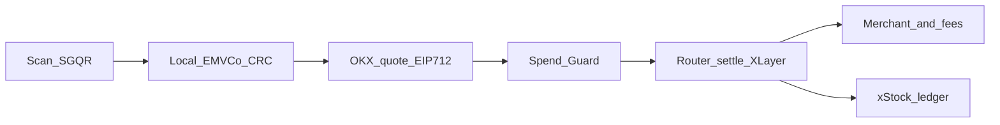

# StockBack

**StockBack** — scan any Singapore SGQR, settle in crypto on X Layer, get **1% back as fractional xStock**, and let **Spend Guard** stop you before you spend an asset at a loss.

<p align="center">
  
</p>

<p align="center">
  <a href="https://stock-back-web.vercel.app/"></a>
  
  
  
  
</p>

**Try it:** [Live app](https://stock-back-web.vercel.app/) · [Seller QR stickers](https://stock-back-web.vercel.app/seller) · [Sample settlement](https://www.okx.com/web3/explorer/xlayer-test/tx/0x582c1763dffa5613b99a440b28f479a1072163405a3ee5c9589570e0886b1beb)

---

## Problem → Solution

**Problem 1:** Singapore already scans — SGQR is everywhere, but fiat-only by design.  
**Solution:** StockBack decodes the sticker already on the counter. The merchant installs nothing.

**Problem 2:** Crypto holders sell on an exchange, wait for the bank, then pay. The two rails never touch.  
**Solution:** Settle the invoice in crypto on X Layer in one router transaction — merchant, treasury, cashback budget.

**Problem 3:** People sell at whatever the day gives them. No checkout asks if that locks in a loss.  
**Solution:** **Spend Guard** blocks by default against the cost basis you recorded (client-side, explained, overridable on purpose).

---

## Impact

Every figure below is published and linked. Nothing estimated.

| Stat | Source |
| --- | --- |
| **210,000+** merchants accept SGQR (90%+ of Singapore merchants) | [MAS parliamentary reply, Oct 2022](https://www.mas.gov.sg/news/parliamentary-replies/2022/reply-to-parliamentary-question-on-prevalence-use-of-cashless-payment-platforms-and-number-of-scam-cases-involving-scan-and-pay-transactions) |
| **32%** of Singaporeans hold or have held crypto | [IRCI Singapore 2026](https://www.independentreserve.com/blog/wp-content/uploads/2026/04/Independent-Reserve-Cryptocurrency-Index-Singapore-2026.pdf) |
| **44%** sold crypto in the last 12 months | [IRCI Singapore 2026](https://www.independentreserve.com/blog/wp-content/uploads/2026/04/Independent-Reserve-Cryptocurrency-Index-Singapore-2026.pdf) |
| **76%** keep crypto at 10% or less of their portfolio | [IRCI Singapore 2026](https://www.independentreserve.com/blog/wp-content/uploads/2026/04/Independent-Reserve-Cryptocurrency-Index-Singapore-2026.pdf) |

---

## How it works



| Rail | What happens |
| --- | --- |
| **Local** | EMVCo TLV + CRC on the phone. The QR is an invoice, never a wallet address. |
| **Off-chain** | Live OKX mark, Spend Guard check, EIP-712 quote signed by the quote signer. |
| **On-chain** | MetaMask + `StockBackRouter.settle` (or `settleWithPermit`). One tx, three transfers, replay-protected. |
| **Ledger** | 1% of the invoice funds fractional xStock cashback. Withdraw when the buffer backs it. |

### Fee split (enforced on-chain)

You pay **invoice + 2%**. The merchant still receives **100% of the invoice**. The router recomputes the split itself — a leaked signer key cannot change the proportions.

| Leg | Share | Where it goes |
| --- | --- | --- |
| Merchant | 100% of invoice | Allowlisted PayNow settlement address |
| Protocol reserve | 1% of invoice | Treasury |
| Cashback budget | 1% of invoice | Funds your xStock ledger credit |

---

## Tech stack

| Layer | Stack |
| --- | --- |
| Web | Next.js 15, Tailwind, viem + EIP-6963 wallet |
| Quote API | OKX v5 public ticker, EIP-712 signer |
| Parser | `@stockback/sgqr` — EMVCo TLV + CRC-16/CCITT |
| Contracts | Hardhat, Solidity 0.8.24 (Paris), OpenZeppelin 5.0.2 |
| On-chain | `StockBackRouter` · DemoUSD (EIP-2612 permit) · MockXNVDA |
| Chain | X Layer testnet · chain ID **1952** |

---

## Try it

| | |
| --- | --- |
| **Live** | https://stock-back-web.vercel.app/ |
| **Seller stickers** | https://stock-back-web.vercel.app/seller |
| **Sample tx** | [`0x582c…1beb`](https://www.okx.com/web3/explorer/xlayer-test/tx/0x582c1763dffa5613b99a440b28f479a1072163405a3ee5c9589570e0886b1beb) · block 41884783 |
| **Router** | [`0x54dFC9…79DD`](https://www.okx.com/web3/explorer/xlayer-test/address/0x54dFC9CcfED6cAc285d60Feb555D3257429879DD) |

Wallet: MetaMask on X Layer testnet (1952). DemoUSD and MockXNVDA are labelled test tokens.

```bash
pnpm install
cp .env.example .env.local
pnpm dev                 # http://localhost:3000
```

Preview mode works immediately (real SGQR parse + OKX pricing). For on-chain settle, fill `DEPLOYER_PRIVATE_KEY` / `QUOTE_SIGNER_PRIVATE_KEY`, run `pnpm deploy:xlayer` + `pnpm seed:xlayer`, then restart. Full walkthrough: [docs/CONTRACTS.md](docs/CONTRACTS.md).

---

## Real vs demo

**Real:** SGQR parsing · live OKX pricing · EIP-712 quotes · X Layer settlement · reward ledger with backing checks.

**Demo stand-ins:** fictional merchants · mintable DemoUSD · labelled MockXNVDA (not issued xStock) · no fiat PayNow leg · **Spend Guard is client-side**, not on-chain.

Read [docs/LIMITATIONS.md](docs/LIMITATIONS.md) before judging.

---

## Repo map

```
apps/web                 Next.js UI + quote API
packages/sgqr            SGQR / EMVCo parser
packages/contracts       StockBackRouter + test tokens
design-system/stockback  Tokens and page specs
docs                     Architecture, contracts, limitations, demo script
```

| Command | What it does |
| --- | --- |
| `pnpm dev` | Web app |
| `pnpm test` | Parser + contract tests |
| `pnpm verify:all` | Typecheck, lint, test, build |
| `pnpm deploy:xlayer` | Deploy to X Layer testnet |
| `pnpm seed:xlayer` | Mint demo balances + fund reward backing |

**Requires:** Node 20.9+, pnpm 10, and a browser wallet on X Layer testnet (1952) for the on-chain path.
